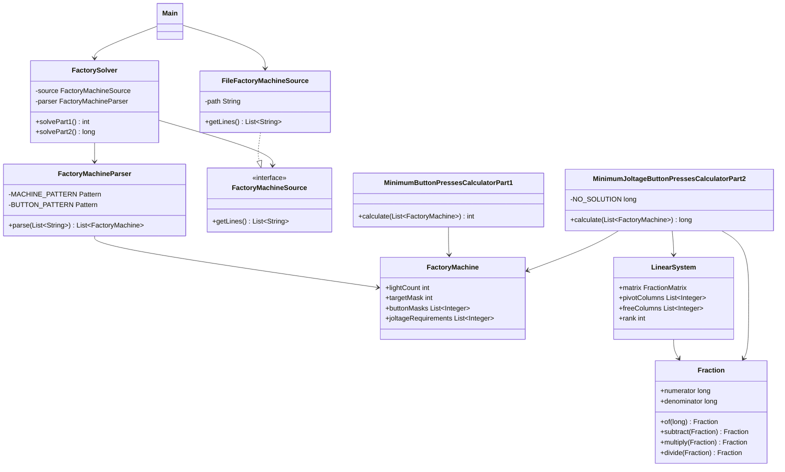

# Día 10

## Problema

El problema ocurre en una fábrica. La entrada contiene una máquina por línea. Cada
línea tiene:

- un diagrama de luces entre corchetes, donde `.` significa apagada y `#` encendida;
- uno o más botones entre paréntesis, indicando qué luces conmuta cada botón;
- requisitos de joltage entre llaves, que en la parte 1 se ignoran.

Un ejemplo de línea es:

```text
[.##.] (3) (1,3) (2) (2,3) (0,2) (0,1) {3,5,4,7}
```

Todas las luces empiezan apagadas. El objetivo es calcular el menor número total de
pulsaciones necesario para configurar todas las máquinas.

La entrada está en:

```text
src/main/resources/input.txt
```

## Parte 1

Como los botones solo conmutan luces, pulsar dos veces el mismo botón deja las luces
igual que antes y solo añade dos pulsaciones. Por eso, para minimizar, cada botón se
considera como usado o no usado.

Con el ejemplo oficial:

```text
[.##.] (3) (1,3) (2) (2,3) (0,2) (0,1) {3,5,4,7}
[...#.] (0,2,3,4) (2,3) (0,4) (0,1,2) (1,2,3,4) {7,5,12,7,2}
[.###.#] (0,1,2,3,4) (0,3,4) (0,1,2,4,5) (1,2) {10,11,11,5,10,5}
```

El resultado es:

```text
7
```

Con el input del proyecto, la respuesta de la parte 1 es:

```text
545
```

## Parte 2

En la segunda parte se ignora el diagrama de luces y se usan los requisitos de
joltage. Cada botón incrementa en `1` todos los contadores que aparecen en su
esquema, y puede pulsarse cualquier número de veces.

Con el ejemplo oficial, el resultado es:

```text
33
```

Con el input del proyecto, la respuesta de la parte 2 es:

```text
22430
```

## Enfoque de la solución

`FactoryMachineParser` convierte el diagrama objetivo y cada botón en máscaras de
bits. También conserva los requisitos de joltage como una lista de enteros.

`MinimumButtonPressesCalculatorPart1` prueba todos los subconjuntos de botones de
cada máquina. Para cada subconjunto aplica XOR con las máscaras de los botones:

```java
currentMask ^= machine.buttonMasks().get(button);
```

Si la máscara resultante coincide con la máscara objetivo, se guarda el menor número
de botones usados.

`MinimumJoltageButtonPressesCalculatorPart2` modela cada máquina como un sistema de
ecuaciones lineales: cada variable es el número de veces que se pulsa un botón, y
cada ecuación representa un contador de joltage. Reduce el sistema con eliminación
gaussiana exacta usando fracciones, y enumera solo las variables libres. En este
input, cada máquina deja como máximo tres variables libres, así que la búsqueda es
exacta y acotada.

## Resolución detallada

### Parte 1

Cada máquina se representa con una máscara de bits: cada luz ocupa un bit y cada
botón indica qué luces cambia. Pulsar un botón equivale a aplicar XOR sobre la
máscara actual. La parte 1 busca el subconjunto de botones con menor número de
pulsaciones que deja la máquina en la máscara objetivo.

La solución enumera todos los subconjuntos posibles de botones. Si una combinación
ya usa más pulsaciones que la mejor conocida, se descarta antes de calcular su
resultado:

```java
int bestPresses = Integer.MAX_VALUE;
int buttonCount = machine.buttonMasks().size();
int combinations = 1 << buttonCount;

for (int combination = 0; combination < combinations; combination++) {
    int currentMask = 0;
    int presses = Integer.bitCount(combination);
    if (presses >= bestPresses) {
        continue;
    }

    for (int button = 0; button < buttonCount; button++) {
        if ((combination & (1 << button)) != 0) {
            currentMask ^= machine.buttonMasks().get(button);
        }
    }

    if (currentMask == machine.targetMask()) {
        bestPresses = presses;
    }
}
```

La respuesta del día es la suma del mínimo de pulsaciones de cada máquina:

```java
return machines.stream()
        .mapToInt(this::minimumPresses)
        .sum();
```

### Parte 2

La segunda parte deja de ser una búsqueda de botones pulsados una vez. Ahora cada
botón puede pulsarse varias veces para alcanzar requisitos de voltaje. El problema
se modela como un sistema lineal: cada contador es una ecuación y cada botón es una
variable que suma `1` a los contadores a los que afecta.

La matriz aumentada se construye con `1` si el botón afecta a un contador y `0` en
caso contrario; la última columna contiene el requisito de voltaje:

```java
for (int counter = 0; counter < counterCount; counter++) {
    for (int button = 0; button < buttonCount; button++) {
        boolean affectsCounter =
                (machine.buttonMasks().get(button) & (1 << counter)) != 0;
        matrix[counter][button] = Fraction.of(affectsCounter ? 1 : 0);
    }
    matrix[counter][buttonCount] =
            Fraction.of(machine.joltageRequirements().get(counter));
}
```

Después se aplica eliminación gaussiana para obtener columnas pivote y columnas
libres. Se usan fracciones exactas para no perder precisión:

```java
Fraction pivotValue = matrix[rank][column];
for (int currentColumn = 0; currentColumn <= buttonCount; currentColumn++) {
    matrix[rank][currentColumn] =
            matrix[rank][currentColumn].divide(pivotValue);
}

for (int row = 0; row < counterCount; row++) {
    if (row == rank || matrix[row][column].isZero()) {
        continue;
    }
    Fraction factor = matrix[row][column];
    for (int currentColumn = 0; currentColumn <= buttonCount; currentColumn++) {
        matrix[row][currentColumn] = matrix[row][currentColumn]
                .subtract(factor.multiply(matrix[rank][currentColumn]));
    }
}
```

Si quedan variables libres, se enumeran sus valores posibles. Para cada asignación
se calculan las variables pivote, y solo se aceptan soluciones enteras, no negativas
y mejores que la mejor ya encontrada:

```java
if (!value.isInteger() || value.isNegative()) {
    return NO_SOLUTION;
}

totalPresses += value.asLong();
if (totalPresses >= best) {
    return NO_SOLUTION;
}
```

Así la parte 2 combina álgebra lineal para reducir el espacio de búsqueda y una
enumeración acotada para escoger la solución con menos pulsaciones.

## Uso de Streams

En este día los Streams se usan para parsear máquinas y para sumar el resultado de
cada máquina en las dos partes.

El parser convierte cada línea del manual en un `FactoryMachine`:

```java
return lines.stream()
        .map(this::parseLine)
        .toList();
```

El stream recorre las líneas de entrada. `map(this::parseLine)` transforma cada línea
en una máquina validada, y `toList()` devuelve la lista final que usan los
calculadores.

La parte 1 suma el mínimo de pulsaciones de todas las máquinas:

```java
return machines.stream()
        .mapToInt(this::minimumPresses)
        .sum();
```

`mapToInt` aplica el algoritmo de enumeración de subconjuntos a cada máquina y
obtiene un entero. `sum()` suma esos mínimos para producir la respuesta de la parte 1.

La parte 2 usa la misma idea, pero con `long`, porque el sistema de voltajes puede
producir resultados mayores:

```java
return machines.stream()
        .mapToLong(this::minimumPresses)
        .sum();
```

Cada elemento se transforma en el mínimo de pulsaciones calculado mediante el sistema
lineal, y `sum()` acumula el total de todas las máquinas.

## Diseño de clases

La solución está dividida en tres paquetes principales:

```text
application/
domain/
  common/
  part1/
  part2/
infrastructure/
```

### `domain/common`

Contiene conceptos compartidos del problema.

- `FactoryMachine`: representa una máquina mediante número de luces, máscara
  objetivo, máscaras de botones y requisitos de joltage.

### `domain/part1`

Contiene la regla específica de la primera parte.

- `MinimumButtonPressesCalculatorPart1`: calcula el menor número total de
  pulsaciones.

### `domain/part2`

Contiene la regla específica de la segunda parte.

- `MinimumJoltageButtonPressesCalculatorPart2`: calcula el menor número total de
  pulsaciones para alcanzar los requisitos de joltage.

### `application`

Coordina el caso de uso.

- `FactoryMachineParser`: transforma las líneas del fichero en máquinas del dominio.
- `FactorySolver`: lee la entrada, la parsea y delega el cálculo.

### `infrastructure`

Contiene los detalles externos al dominio.

- `FactoryMachineSource`: interfaz para obtener las líneas de entrada.
- `FileFactoryMachineSource`: implementación que lee las máquinas desde un fichero.

## Diagrama de clases



## Fundamentos de diseño aplicados

### Alta Cohesión

`FactoryMachine` representa una máquina validada, `MinimumButtonPressesCalculatorPart1`
enumera combinaciones de botones y `MinimumJoltageButtonPressesCalculatorPart2`
resuelve el sistema de voltajes. El parser solo interpreta el formato textual.

### Bajo Acoplamiento

`FactorySolver` depende de `FactoryMachineSource`. Las calculadoras reciben
`FactoryMachine` y no conocen cómo se obtiene ni cómo se parsea el manual.

### Modularidad

La representación común de máquinas está separada de los dos algoritmos. La
eliminación gaussiana queda encapsulada dentro de la parte 2 y no afecta a la parte 1.

### Código Expresivo

Nombres como `targetMask`, `buttonMasks`, `joltageRequirements`,
`pivotColumns` y `freeColumns` hacen visible la estructura del problema y del sistema
lineal.

### Abstracción

`FactoryMachine` oculta la validación de máscaras y requisitos. `Fraction` oculta la
aritmética exacta necesaria para la eliminación gaussiana.

## Principios aplicados

### Principio de Responsabilidad Única (SRP)

`FactoryMachineParser` parsea máquinas, `FactoryMachine` representa una máquina válida, `MinimumButtonPressesCalculatorPart1` enumera combinaciones de botones, `MinimumJoltageButtonPressesCalculatorPart2` resuelve el sistema de voltajes y `FactorySolver` coordina.

### Principio Abierto/Cerrado (OCP)

La parte 2 añade una resolución algebraica nueva sin modificar la calculadora de la parte 1. `FactoryMachine` queda como modelo común estable para ambas reglas.

### Principio de Sustitución de Liskov (LSP)

`FactorySolver` depende de `FactoryMachineSource`. Una fuente alternativa compatible puede reemplazar a `FileFactoryMachineSource`.

### Principio de Segregación de la Interfaz (ISP)

`FactoryMachineSource` solo obliga a leer líneas. La interfaz no mezcla responsabilidades de parseo, resolución o salida.

### Principio de Inversión de Dependencias (DIP)

La capa de aplicación recibe una abstracción:

```java
public FactorySolver(FactoryMachineSource source) {
    this.source = source;
}
```

Así, la lógica de alto nivel no depende de la lectura concreta desde fichero.

### Principio de Composición sobre Herencia (COI)

El solver compone el modelo común con calculadoras concretas para cada parte. No se usa herencia para compartir comportamiento entre algoritmos tan distintos.

### Principio DRY

`FactoryMachine` centraliza luces, botones, máscaras y requisitos. Las dos partes reutilizan esa representación y no duplican validaciones del manual.

### Convención sobre Configuración (CoC)

La organización Maven del módulo permite compilar, probar y cargar recursos mediante convenciones, sin configuración manual por día.

### Principio YAGNI

No se implementa un solucionador matemático genérico. La eliminación gaussiana y las fracciones exactas se incluyen porque la parte 2 las necesita, pero no se generalizan más allá del problema.

## Patrones de diseño aplicados

### Creacionales

Se refleja `Factory Method` en el método `Fraction.of(...)` usado por la parte 2. En
vez de crear directamente una fracción para representar un entero con
`new Fraction(value, 1)`, el código usa un método estático que encapsula esa creación:

```java
static Fraction of(long value) {
    return new Fraction(value, 1);
}
```

No se aplica `Singleton`, porque no existe ningún recurso global que deba tener una
única instancia.

### Estructurales

Se refleja `Adapter` en `FileFactoryMachineSource`. La aplicación trabaja con
`FactoryMachineSource`, mientras que `FileFactoryMachineSource` adapta
`Files.readAllLines` a esa interfaz propia del proyecto.

No se aplica `Decorator`, porque no se añaden responsabilidades dinámicamente a un
objeto envolviéndolo con otros objetos.

### De comportamiento

Se refleja `Iterator` mediante el uso de colecciones y bucles `for-each`, por ejemplo
al recorrer máquinas, botones y requisitos. En Java este recorrido se apoya en
`Iterable`/`Iterator`, aunque el código no cree el iterador manualmente.

No se aplica `Command`, porque los botones se modelan como datos de la máquina y no
como objetos que encapsulen una acción ejecutable. Tampoco se aplica `Observer`,
porque no hay suscripciones ni notificación de cambios.

## Tests

Los tests están en:

```text
src/test/java/
```

Cubren:

- el parseo de una máquina válida;
- el rechazo de líneas inválidas;
- el ejemplo oficial de la parte 1, cuyo resultado esperado es `7`;
- que no hace falta pulsar un botón más de una vez para configurar solo luces.
- el ejemplo oficial de la parte 2, cuyo resultado esperado es `33`;
- que en la parte 2 un botón pueda pulsarse varias veces.

Para ejecutar los tests desde la raíz del repositorio:

```bash
mvn -pl dia10 test
```

## Ejecución

Desde la raíz del repositorio:

```bash
mvn -pl dia10 exec:java -Dexec.mainClass=Main
```

El programa imprime:

```text
Parte 1: 545
Parte 2: 22430
```
