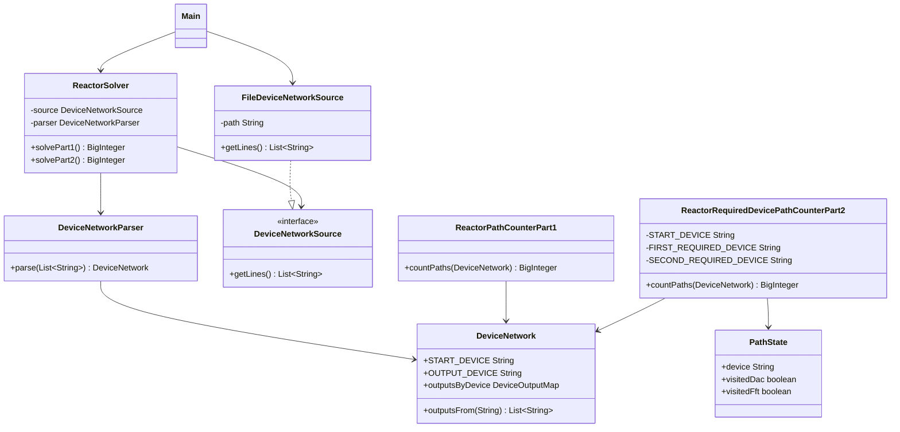

# Día 11

## Problema

El problema ocurre en el reactor de la fábrica. La entrada describe una red dirigida
de dispositivos:

```text
you: bbb ccc
bbb: ddd eee
```

Cada línea indica un dispositivo y la lista de dispositivos a los que van sus
salidas. Los datos fluyen solo hacia delante por esas conexiones. El objetivo de la
parte 1 es contar cuántos caminos distintos llevan desde `you` hasta `out`.

La entrada está en:

```text
src/main/resources/input.txt
```

## Parte 1

Con el ejemplo oficial:

```text
aaa: you hhh
you: bbb ccc
bbb: ddd eee
ccc: ddd eee fff
ddd: ggg
eee: out
fff: out
ggg: out
hhh: ccc fff iii
iii: out
```

El resultado es:

```text
5
```

Con el input del proyecto, la respuesta de la parte 1 es:

```text
590
```

## Parte 2

Ahora hay que contar los caminos desde `svr` hasta `out`, pero solo aquellos que
pasan por `dac` y por `fft`, en cualquier orden.

Con el ejemplo oficial de la parte 2, el resultado es:

```text
2
```

Con el input del proyecto, la respuesta de la parte 2 es:

```text
319473830844560
```

## Enfoque de la solución

`DeviceNetworkParser` transforma cada línea en una entrada del grafo dirigido. El
dominio guarda un mapa desde cada dispositivo hasta sus salidas.

`ReactorPathCounterPart1` cuenta caminos con una búsqueda en profundidad desde
`you`. Para evitar recalcular subgrafos compartidos, memoiza el número de caminos
desde cada dispositivo:

```java
memoizedPaths.put(device, totalPaths);
```

Cuando la búsqueda llega a `out`, devuelve `1`, porque se ha encontrado un camino
completo. Si un dispositivo no tiene salidas y no es `out`, devuelve `0`. Se usa
`BigInteger` para no limitar artificialmente el número de caminos.

`ReactorRequiredDevicePathCounterPart2` usa la misma idea, pero añade estado a la
búsqueda: dispositivo actual, si ya se ha pasado por `dac` y si ya se ha pasado por
`fft`. Al llegar a `out`, solo cuenta el camino si ambos dispositivos requeridos ya
han sido visitados.

## Resolución detallada

### Parte 1

El input describe una red dirigida de dispositivos. La parte 1 cuenta cuántos
caminos distintos van desde `you` hasta `out`. La solución usa búsqueda en
profundidad con memoización: una vez calculado cuántos caminos salen de un
dispositivo, ese resultado se reutiliza cuando otro camino llega al mismo nodo.

El caso base es llegar a `out`, que aporta un camino válido:

```java
if (DeviceNetwork.OUTPUT_DEVICE.equals(device)) {
    return BigInteger.ONE;
}
```

La memoización evita recalcular subgrafos compartidos:

```java
if (memoizedPaths.containsKey(device)) {
    return memoizedPaths.get(device);
}
```

El total de caminos desde un dispositivo es la suma de los caminos desde todas sus
salidas:

```java
BigInteger totalPaths = BigInteger.ZERO;
for (String output : network.outputsFrom(device)) {
    totalPaths = totalPaths.add(
            countFrom(output, network, memoizedPaths, visiting));
}

memoizedPaths.put(device, totalPaths);
return totalPaths;
```

Se mantiene además un conjunto `visiting` para detectar ciclos y fallar de forma
explícita si el grafo no es acíclico.

### Parte 2

La segunda parte cuenta caminos que salen de `svr`, llegan a `out` y pasan por dos
dispositivos obligatorios: `dac` y `fft`. Para resolverlo se amplía el estado de la
búsqueda. Ya no basta con saber el dispositivo actual; también hay que saber si el
camino ha visitado cada dispositivo requerido.

```java
private record PathState(String device, boolean visitedDac, boolean visitedFft) {
    PathState withVisitedDevice() {
        return new PathState(
                device,
                visitedDac || FIRST_REQUIRED_DEVICE.equals(device),
                visitedFft || SECOND_REQUIRED_DEVICE.equals(device)
        );
    }

    boolean hasVisitedBothRequiredDevices() {
        return visitedDac && visitedFft;
    }
}
```

Al llegar a `out`, el camino solo cuenta si el estado ya ha pasado por ambos
dispositivos:

```java
PathState updatedState = state.withVisitedDevice();
if (DeviceNetwork.OUTPUT_DEVICE.equals(updatedState.device())) {
    return updatedState.hasVisitedBothRequiredDevices()
            ? BigInteger.ONE
            : BigInteger.ZERO;
}
```

La recursión y la memoización son iguales que en la parte 1, pero la clave de la
memoria pasa a ser `PathState`:

```java
for (String output : network.outputsFrom(updatedState.device())) {
    totalPaths = totalPaths.add(countFrom(
            updatedState.moveTo(output),
            network,
            memoizedPaths,
            visiting));
}
```

De esta forma se reutiliza el mismo enfoque de conteo de caminos, pero la regla de
validez se expresa en el estado.

## Uso de Streams

En este día el stream aparece al construir `DeviceNetwork`. La entrada parseada se
recibe como un `Map<String, List<String>>`, pero el record guarda una copia
inmutable para proteger el estado interno.

```java
outputsByDevice = outputsByDevice.entrySet().stream()
        .collect(java.util.stream.Collectors.toUnmodifiableMap(
                Map.Entry::getKey,
                entry -> List.copyOf(entry.getValue())
        ));
```

El stream recorre las entradas del mapa original. `collect(toUnmodifiableMap(...))`
construye un nuevo mapa no modificable. La clave se mantiene con `Map.Entry::getKey`
y el valor se copia con `List.copyOf(...)` para que tampoco pueda modificarse la
lista de salidas desde fuera.

Este stream no calcula la respuesta del puzzle directamente; refuerza la seguridad
del modelo de dominio para que los contadores de caminos trabajen con una red estable.

## Diseño de clases

La solución está dividida en tres paquetes principales:

```text
application/
domain/
  common/
  part1/
  part2/
infrastructure/
```

### `domain/common`

Contiene conceptos compartidos del problema.

- `DeviceNetwork`: representa la red dirigida de dispositivos.

### `domain/part1`

Contiene la regla específica de la primera parte.

- `ReactorPathCounterPart1`: cuenta los caminos desde `you` hasta `out`.

### `domain/part2`

Contiene la regla específica de la segunda parte.

- `ReactorRequiredDevicePathCounterPart2`: cuenta los caminos desde `svr` hasta
  `out` que pasan por `dac` y `fft`.

### `application`

Coordina el caso de uso.

- `DeviceNetworkParser`: transforma las líneas del fichero en un `DeviceNetwork`.
- `ReactorSolver`: lee la entrada, la parsea y delega el cálculo.

### `infrastructure`

Contiene los detalles externos al dominio.

- `DeviceNetworkSource`: interfaz para obtener las líneas de entrada.
- `FileDeviceNetworkSource`: implementación que lee la red desde un fichero.

## Diagrama de clases



## Principios aplicados

### Principio de Responsabilidad Única (SRP)

`DeviceNetworkParser` parsea la red, `DeviceNetwork` representa conexiones, `ReactorPathCounterPart1` cuenta caminos simples hacia `out`, `ReactorRequiredDevicePathCounterPart2` cuenta caminos con dispositivos obligatorios y `ReactorSolver` coordina.

### Principio Abierto/Cerrado (OCP)

La parte 2 añade una regla de conteo con estado (`PathState`) sin modificar `ReactorPathCounterPart1` ni `DeviceNetwork`. El modelo común de red queda cerrado y reutilizable.

### Principio de Sustitución de Liskov (LSP)

`ReactorSolver` usa `DeviceNetworkSource`. Cualquier implementación que entregue líneas de red válidas puede sustituir a `FileDeviceNetworkSource`.

### Principio de Segregación de la Interfaz (ISP)

`DeviceNetworkSource` es específica y pequeña: solo lectura de líneas. No fuerza a implementar operaciones de grafo que corresponden al dominio.

### Principio de Inversión de Dependencias (DIP)

El solver depende de la abstracción `DeviceNetworkSource`:

```java
public ReactorSolver(DeviceNetworkSource source) {
    this.source = source;
}
```

### Principio de Composición sobre Herencia (COI)

Las dos reglas de conteo son servicios concretos que componen `DeviceNetwork`. No hay herencia entre contadores de caminos.

### Principio DRY

`DeviceNetwork` concentra la representación de salidas por dispositivo. Ambos contadores reutilizan `outputsFrom` y no duplican la estructura del grafo.

### Convención sobre Configuración (CoC)

El día sigue el layout Maven estándar del repositorio, lo que reduce configuración explícita.

### Principio YAGNI

No se crea un framework de grafos general. La solución implementa solo conteo de caminos con memoización y el estado adicional requerido por la parte 2.

## Patrones de diseño aplicados

### Creacionales

No se aplica ningún patrón creacional de forma explícita. No hace falta `Singleton`
porque no existe ningún recurso global que deba tener una única instancia, y tampoco
se usa `Factory Method` porque la creación de objetos es simple y directa.

### Estructurales

Se refleja `Adapter` en `FileDeviceNetworkSource`. La aplicación trabaja con
`DeviceNetworkSource`, mientras que `FileDeviceNetworkSource` adapta
`Files.readAllLines` a esa interfaz propia del proyecto.

No se aplica `Decorator`, porque no se añaden responsabilidades dinámicamente a un
objeto envolviéndolo con otros objetos.

### De comportamiento

Se refleja `Iterator` mediante el uso de colecciones y bucles `for-each`, por ejemplo
al recorrer salidas de dispositivos. En Java este recorrido se apoya en
`Iterable`/`Iterator`, aunque el código no cree el iterador manualmente.

No se aplica `Command`, porque no hay objetos que encapsulen acciones ejecutables.
Tampoco se aplica `Observer`, porque no hay suscripciones ni notificación de cambios.

## Otras técnicas de diseño

### Abstracción del origen de datos

`DeviceNetworkSource` abstrae el origen de datos. El dominio no depende de si la
entrada viene de un fichero, de memoria o de otro sistema.

### Objeto de valor

`DeviceNetwork` se modela como `record`, por lo que representa un valor del dominio
definido por sus conexiones.

### Servicio de dominio

`ReactorPathCounterPart1` actúa como servicio de dominio: no representa una entidad
con identidad propia, sino una operación que calcula el resultado de la parte 1.

`ReactorRequiredDevicePathCounterPart2` también actúa como servicio de dominio, pero
para la regla de caminos obligatorios de la segunda parte.

### Memoización

El conteo de caminos usa memoización para no recalcular el número de caminos desde
un mismo dispositivo cuando varios caminos previos llegan a él.

En la parte 2 la clave memoizada no es solo el dispositivo, sino también los dos
booleanos que indican si el camino ya ha pasado por `dac` y por `fft`.

## Tests

Los tests están en:

```text
src/test/java/
```

Cubren:

- el parseo de conexiones;
- el rechazo de descripciones inválidas;
- el ejemplo oficial de la parte 1, cuyo resultado esperado es `5`;
- la detección de ciclos alcanzables desde `you`.
- el ejemplo oficial de la parte 2, cuyo resultado esperado es `2`;
- que la parte 2 ignore caminos que no pasan por los dos dispositivos requeridos.

Para ejecutar los tests desde la raíz del repositorio:

```bash
mvn -pl dia11 test
```

## Ejecución

Desde la raíz del repositorio:

```bash
mvn -pl dia11 exec:java -Dexec.mainClass=Main
```

El programa imprime:

```text
Parte 1: 590
Parte 2: 319473830844560
```
