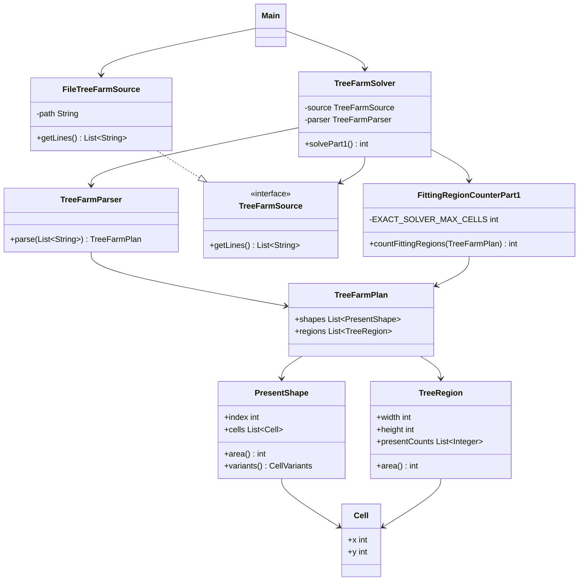

# Día 12

## Problema

El problema ocurre en una granja de árboles de Navidad. La entrada contiene:

- una lista de formas de regalos, representadas con `#` y `.`;
- una lista de regiones rectangulares bajo los árboles;
- para cada región, cuántos regalos de cada forma deben colocarse.

Los regalos pueden rotarse y reflejarse, pero deben colocarse sobre una cuadrícula
bidimensional. No pueden solaparse, aunque los huecos `.` de una forma no bloquean a
otras formas.

La entrada está en:

```text
src/main/resources/input.txt
```

## Parte 1

El objetivo es contar cuántas regiones pueden contener todos los regalos indicados.

Con el ejemplo oficial:

```text
4x4: 0 0 0 0 2 0
12x5: 1 0 1 0 2 2
12x5: 1 0 1 0 3 2
```

El resultado es:

```text
2
```

Con el input del proyecto, la respuesta de la parte 1 es:

```text
587
```

## Enfoque de la solución

`TreeFarmParser` separa la entrada en dos partes: primero parsea las formas de los
regalos y después las regiones. Cada forma se convierte en una lista de celdas
ocupadas.

`FittingRegionCounterPart1` aplica dos niveles de decisión:

- si el área total de los regalos supera el área de la región, la región no puede
  servir;
- para regiones pequeñas, usa un solver exacto de colocación con todas las
  rotaciones y reflexiones de cada forma;
- para las regiones grandes del input, donde todas tienen anchura y altura muy por
  encima de las formas de 3x3, la restricción efectiva es el área total disponible.

El solver exacto se usa en los tests del ejemplo oficial. Esto evita aceptar casos
pequeños que tienen área suficiente pero no admiten una colocación real.

## Resolución detallada

### Parte 1

El problema comprueba en qué regiones de la granja caben los regalos requeridos.
Cada forma de regalo está definida por celdas ocupadas, y cada región indica cuántas
copias de cada forma debe colocar. La primera poda es por área: si la suma de áreas
de todas las piezas requeridas supera el área de la región, no puede encajar.

```java
private int requiredArea(List<PresentShape> shapes, TreeRegion region) {
    int area = 0;
    for (int index = 0; index < shapes.size(); index++) {
        area += shapes.get(index).area() * region.presentCounts().get(index);
    }
    return area;
}
```

Para regiones pequeñas se hace una comprobación exacta con backtracking. Primero se
generan todas las colocaciones posibles de cada pieza. Las rotaciones y reflexiones
de una forma se normalizan para eliminar variantes duplicadas:

```java
public List<List<Cell>> variants() {
    Set<List<Cell>> uniqueVariants = new HashSet<>();
    for (int reflection : List.of(1, -1)) {
        for (int rotation = 0; rotation < 4; rotation++) {
            List<Cell> transformed = new ArrayList<>();
            for (Cell cell : cells) {
                int x = cell.x() * reflection;
                int y = cell.y();
                for (int turn = 0; turn < rotation; turn++) {
                    int nextX = -y;
                    y = x;
                    x = nextX;
                }
                transformed.add(new Cell(x, y));
            }
            uniqueVariants.add(normalize(transformed));
        }
    }
    return List.copyOf(uniqueVariants);
}
```

Cada colocación se codifica como una máscara de bits. Dos piezas se solapan si sus
máscaras tienen algún bit común:

```java
for (List<Cell> variant : shape.variants()) {
    int variantWidth = variant.stream().mapToInt(Cell::x).max().orElseThrow() + 1;
    int variantHeight = variant.stream().mapToInt(Cell::y).max().orElseThrow() + 1;
    for (int y = 0; y <= region.height() - variantHeight; y++) {
        for (int x = 0; x <= region.width() - variantWidth; x++) {
            long mask = 0L;
            for (Cell cell : variant) {
                int bit = (y + cell.y()) * region.width() + x + cell.x();
                mask |= 1L << bit;
            }
            placements.add(mask);
        }
    }
}
```

El backtracking intenta colocar las piezas una a una. Si una colocación no se solapa
con las celdas ocupadas, se avanza; si un estado ya falló antes, se reutiliza ese
fallo con memoización:

```java
private boolean search(List<PiecePlacements> pieces,
                       int pieceIndex,
                       long occupiedCells,
                       Map<SearchState, Boolean> memoizedFailures) {
    if (pieceIndex == pieces.size()) {
        return true;
    }

    SearchState state = new SearchState(pieceIndex, occupiedCells);
    if (memoizedFailures.containsKey(state)) {
        return false;
    }

    for (long placement : pieces.get(pieceIndex).placements()) {
        if ((occupiedCells & placement) == 0
                && search(pieces, pieceIndex + 1,
                        occupiedCells | placement, memoizedFailures)) {
            return true;
        }
    }

    memoizedFailures.put(state, false);
    return false;
}
```

Para regiones grandes, la solución actual aplica una comprobación conservadora por
área. Es una decisión práctica para mantener el coste acotado con el input actual.

### Parte 2

La parte 2 de este día no está implementada todavía en el proyecto. Cuando se añada
el segundo enunciado, debería incorporarse como una nueva clase en `domain/part2`,
reutilizando `TreeFarmPlan`, `PresentShape`, `TreeRegion` y las operaciones comunes
de generación de variantes. Así se mantiene el mismo criterio de Abierto/Cerrado
que en los días anteriores: añadir una regla nueva sin modificar la solución de la
parte 1.

Un punto de partida natural sería crear una calculadora específica:

```java
package domain.part2;

import domain.common.TreeFarmPlan;

public class FittingRegionCounterPart2 {
    public long count(TreeFarmPlan plan) {
        // aplicar aquí la regla nueva del segundo enunciado
        throw new UnsupportedOperationException("Parte 2 pendiente");
    }
}
```

## Uso de Streams

En este día los Streams se usan sobre todo para normalizar formas y generar
colocaciones posibles.

`PresentShape.normalize` busca primero el desplazamiento mínimo necesario para mover
la figura al origen:

```java
int minX = cells.stream().mapToInt(Cell::x).min().orElseThrow();
int minY = cells.stream().mapToInt(Cell::y).min().orElseThrow();
```

Cada stream recorre las celdas de la forma. `mapToInt(Cell::x)` y `mapToInt(Cell::y)`
extraen coordenadas primitivas, `min()` obtiene la menor coordenada y `orElseThrow()`
expresa que una forma siempre debe tener al menos una celda.

Después se crea la forma normalizada:

```java
return cells.stream()
        .map(cell -> new Cell(cell.x() - minX, cell.y() - minY))
        .distinct()
        .sorted(java.util.Comparator.comparingInt(Cell::y).thenComparingInt(Cell::x))
        .toList();
```

`map` desplaza cada celda para que la figura empiece en `(0,0)`. `distinct` elimina
celdas duplicadas, `sorted` ordena primero por fila (`y`) y luego por columna (`x`),
y `toList()` devuelve una representación estable de la variante.

En el backtracking se calculan dimensiones de cada variante:

```java
int variantWidth = variant.stream().mapToInt(Cell::x).max().orElseThrow() + 1;
int variantHeight = variant.stream().mapToInt(Cell::y).max().orElseThrow() + 1;
```

Estos streams obtienen la coordenada máxima de la variante y suman `1` para convertir
coordenadas en anchura y altura reales.

Finalmente, las colocaciones generadas se limpian con:

```java
return placements.stream().distinct().toList();
```

El stream elimina máscaras repetidas que pueden aparecer cuando dos rotaciones o
reflexiones producen la misma forma. `toList()` devuelve la lista de colocaciones
únicas que usará el backtracking.

## Diseño de clases

La solución está dividida en tres paquetes principales:

```text
application/
domain/
  common/
  part1/
infrastructure/
```

### `domain/common`

Contiene conceptos compartidos del problema.

- `Cell`: representa una celda ocupada de una forma.
- `PresentShape`: representa una forma de regalo y genera sus variantes por rotación
  y reflexión.
- `TreeRegion`: representa una región rectangular y los regalos que debe contener.
- `TreeFarmPlan`: agrupa formas y regiones.

### `domain/part1`

Contiene la regla específica de la primera parte.

- `FittingRegionCounterPart1`: cuenta cuántas regiones pueden contener sus regalos.

### `application`

Coordina el caso de uso.

- `TreeFarmParser`: transforma las líneas del fichero en un `TreeFarmPlan`.
- `TreeFarmSolver`: lee la entrada, la parsea y delega el cálculo.

### `infrastructure`

Contiene los detalles externos al dominio.

- `TreeFarmSource`: interfaz para obtener las líneas de entrada.
- `FileTreeFarmSource`: implementación que lee el plan desde un fichero.

## Diagrama de clases



## Fundamentos de diseño aplicados

### Alta Cohesión

`PresentShape` se centra en formas y variantes, `TreeRegion` en regiones,
`TreeFarmPlan` en agrupar el problema y `FittingRegionCounterPart1` en comprobar si
las piezas caben.

### Bajo Acoplamiento

`TreeFarmSolver` depende de `TreeFarmSource`. El backtracking recibe un
`TreeFarmPlan` ya construido y no depende del parser ni de la lectura del fichero.

### Modularidad

Las piezas reutilizables (`Cell`, `PresentShape`, `TreeRegion`, `TreeFarmPlan`) están
en `domain/common`. La regla disponible está aislada en `domain/part1`, dejando un
sitio claro para una futura parte 2.

### Código Expresivo

`variants`, `normalize`, `placementsFor`, `occupiedCells` y `memoizedFailures`
explican las fases del algoritmo de encaje sin esconder la intención detrás de
nombres genéricos.

### Abstracción

Las formas se manejan como `PresentShape` y sus variantes, no como listas sueltas de
coordenadas en todo el código. Las colocaciones se abstraen como máscaras para que el
backtracking compruebe solapes con una operación simple.

## Principios aplicados

### Principio de Responsabilidad Única (SRP)

`TreeFarmParser` parsea la entrada, `PresentShape` representa formas y variantes, `TreeRegion` representa regiones, `TreeFarmPlan` agrupa el problema, `FittingRegionCounterPart1` comprueba encaje y `TreeFarmSolver` coordina.

### Principio Abierto/Cerrado (OCP)

El dominio común (`Cell`, `PresentShape`, `TreeRegion`, `TreeFarmPlan`) queda preparado para reutilizarse cuando se añada una parte 2. Esa futura regla podría ir en `domain/part2` sin modificar la solución de la parte 1.

### Principio de Sustitución de Liskov (LSP)

`TreeFarmSolver` depende de `TreeFarmSource`. Otra implementación que entregue las líneas del plan puede sustituir a `FileTreeFarmSource`.

### Principio de Segregación de la Interfaz (ISP)

`TreeFarmSource` solo expone la lectura de líneas. No obliga a una fuente de datos a conocer formas, regiones ni backtracking.

### Principio de Inversión de Dependencias (DIP)

La aplicación depende de `TreeFarmSource` y recibe la implementación concreta por constructor:

```java
public TreeFarmSolver(TreeFarmSource source) {
    this.source = source;
}
```

### Principio de Composición sobre Herencia (COI)

La solución compone records pequeños (`Cell`, `PresentShape`, `TreeRegion`) y un servicio de dominio. No se crea una jerarquía de piezas o regiones abstractas.

### Principio DRY

La normalización de formas, la generación de variantes y la representación de regiones están centralizadas en clases comunes. El backtracking no repite estructuras de coordenadas ni dimensiones.

### Convención sobre Configuración (CoC)

El módulo sigue las convenciones Maven, por lo que código, recursos y tests se encuentran sin configuración adicional.

### Principio YAGNI

No se implementa todavía una parte 2 ni un empaquetador general de piezas. El código se limita a la regla disponible y deja el punto de extensión preparado.

## Patrones de diseño aplicados

### Creacionales

No se aplica ningún patrón creacional de forma explícita. No hace falta `Singleton`
porque no existe ningún recurso global que deba tener una única instancia, y tampoco
se usa `Factory Method` porque la creación de objetos es simple y directa.

### Estructurales

Se refleja `Adapter` en `FileTreeFarmSource`. La aplicación trabaja con
`TreeFarmSource`, mientras que `FileTreeFarmSource` adapta `Files.readAllLines` a esa
interfaz propia del proyecto.

No se aplica `Decorator`, porque no se añaden responsabilidades dinámicamente a un
objeto envolviéndolo con otros objetos.

### De comportamiento

Se refleja `Iterator` mediante el uso de colecciones y bucles `for-each`, por ejemplo
al recorrer regiones, formas y colocaciones. En Java este recorrido se apoya en
`Iterable`/`Iterator`, aunque el código no cree el iterador manualmente.

No se aplica `Command`, porque no hay objetos que encapsulen acciones ejecutables.
Tampoco se aplica `Observer`, porque no hay suscripciones ni notificación de cambios.

## Tests

Los tests están en:

```text
src/test/java/
```

Cubren:

- el parseo de formas y regiones;
- el ejemplo oficial de la parte 1, cuyo resultado esperado es `2`;
- el caso pequeño no trivial donde el área no basta por sí sola.

Para ejecutar los tests desde la raíz del repositorio:

```bash
mvn -pl dia12 test
```

## Ejecución

Desde la raíz del repositorio:

```bash
mvn -pl dia12 exec:java -Dexec.mainClass=Main
```

El programa imprime:

```text
Parte 1: 587
```
