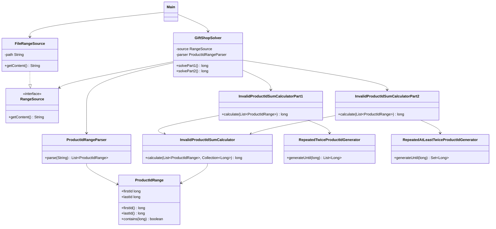

# Día 2

## Problema

El problema ocurre en la tienda de regalos del Polo Norte. La base de datos contiene
rangos de IDs de producto, pero algunos IDs son inválidos porque siguen patrones
repetitivos.

La entrada es una única línea con rangos separados por comas:

```text
11-22,95-115,998-1012
```

Cada rango está formado por:

- primer ID del rango;
- guion `-`;
- último ID del rango.

El rango incluye ambos extremos. Por ejemplo, `11-22` incluye tanto `11` como `22`.

Los IDs no tienen ceros a la izquierda. Por eso `0101` no se considera un ID válido.

## Parte 1

En la primera parte, un ID es inválido si está formado por una secuencia de dígitos
repetida exactamente dos veces.

Ejemplos:

- `55` es inválido porque es `5` repetido dos veces.
- `6464` es inválido porque es `64` repetido dos veces.
- `123123` es inválido porque es `123` repetido dos veces.

El objetivo es encontrar todos los IDs inválidos que aparecen dentro de los rangos de
entrada y sumarlos.

Con el ejemplo oficial, la suma de la parte 1 es:

```text
1227775554
```

Con el input del proyecto, la respuesta de la parte 1 es:

```text
21139440284
```

## Parte 2

En la segunda parte, la regla se amplía. Ahora un ID es inválido si está formado por
una secuencia de dígitos repetida al menos dos veces.

Ejemplos:

- `12341234` es inválido porque `1234` se repite dos veces.
- `123123123` es inválido porque `123` se repite tres veces.
- `1212121212` es inválido porque `12` se repite cinco veces.
- `1111111` es inválido porque `1` se repite siete veces.

Esta regla incluye todos los casos de la parte 1, pero añade IDs con tres o más
repeticiones.

Con el ejemplo oficial, la suma de la parte 2 es:

```text
4174379265
```

Con el input del proyecto, la respuesta de la parte 2 es:

```text
38731915928
```

## Enfoque de la solución

Una solución directa sería recorrer todos los números de todos los rangos y comprobar
si cada número cumple el patrón. Esa opción es sencilla, pero no escala bien cuando
los rangos contienen millones o miles de millones de IDs.

La solución implementada hace lo contrario: genera solo los IDs que pueden ser
inválidos y después comprueba si están dentro de alguno de los rangos.

### Generación de candidatos para la parte 1

`RepeatedTwiceProductIdGenerator` genera candidatos repitiendo un prefijo
exactamente dos veces:

```text
1   -> 11
2   -> 22
64  -> 6464
123 -> 123123
```

Después, `InvalidProductIdSumCalculatorPart1` usa esos candidatos para calcular la
suma de los que aparecen en los rangos.

### Generación de candidatos para la parte 2

`RepeatedAtLeastTwiceProductIdGenerator` generaliza la idea anterior. Toma un bloque
de dígitos y lo repite dos, tres, cuatro o más veces mientras el número generado no
supere el mayor ID de la entrada.

Por ejemplo, con el bloque `12` se generan:

```text
1212
121212
12121212
```

Los candidatos se guardan en un `Set` para evitar duplicados. Esto es necesario
porque un mismo número puede cumplir la regla de más de una forma. Por ejemplo,
`1111` puede verse como `11` repetido dos veces o como `1` repetido cuatro veces,
pero solo debe sumarse una vez.

## Resolución detallada

### Parte 1

La primera parte busca identificadores formados por un bloque de dígitos repetido
exactamente dos veces: `55`, `6464`, `123123`, etc. En vez de recorrer todos los
números de todos los rangos, se generan directamente los candidatos inválidos hasta
el mayor identificador del input. Así el coste depende del número de patrones
posibles, no del tamaño total de los intervalos.

El generador toma un prefijo y lo concatena consigo mismo:

```java
private long repeatTwice(long prefix) {
    String digits = String.valueOf(prefix);
    return Long.parseLong(digits + digits);
}
```

Se prueban prefijos de longitud creciente. Cuando el primer identificador de una
longitud ya supera el máximo del input, no puede aparecer ningún candidato mayor
útil y se termina:

```java
for (int digits = 1; ; digits++) {
    long firstPrefix = powerOfTen(digits - 1);
    long lastPrefix = powerOfTen(digits) - 1;
    long firstIdWithDigits = repeatTwice(firstPrefix);

    if (firstIdWithDigits > maxId) {
        return invalidIds;
    }

    for (long prefix = firstPrefix; prefix <= lastPrefix; prefix++) {
        long invalidId = repeatTwice(prefix);
        if (invalidId > maxId) {
            break;
        }
        invalidIds.add(invalidId);
    }
}
```

Después, `InvalidProductIdSumCalculator` filtra esos candidatos contra los rangos
del input y suma cada ID una sola vez:

```java
for (ProductIdRange range : ranges) {
    for (long invalidId : invalidIds) {
        if (range.contains(invalidId)) {
            invalidIdsInRanges.add(invalidId);
        }
    }
}
```

### Parte 2

La segunda parte amplía la regla: el bloque puede repetirse dos o más veces. Por
eso el generador ya no concatena siempre dos bloques, sino que va acumulando
repeticiones hasta superar el número máximo de dígitos.

El límite `maxDigits / 2` evita bloques que nunca podrían repetirse al menos dos
veces dentro del tamaño máximo del input:

```java
for (int blockLength = 1; blockLength <= maxDigits / 2; blockLength++) {
    long firstBlock = powerOfTen(blockLength - 1);
    long lastBlock = powerOfTen(blockLength) - 1;
    for (long block = firstBlock; block <= lastBlock; block++) {
        addRepeatedIds(block, maxDigits, maxId, invalidIds);
    }
}
```

Cada bloque se repite incrementalmente. Solo se añaden valores cuando hay al menos
dos repeticiones, y se usa un `Set` para no duplicar identificadores que puedan
generarse de más de una forma:

```java
String blockDigits = String.valueOf(block);
StringBuilder repeatedDigits = new StringBuilder();

for (int repetitions = 1; repeatedDigits.length() <= maxDigits; repetitions++) {
    repeatedDigits.append(blockDigits);
    if (repetitions < 2) {
        continue;
    }

    long invalidId = Long.parseLong(repeatedDigits.toString());
    if (invalidId > maxId) {
        return;
    }
    invalidIds.add(invalidId);
}
```

La fase final de filtrado y suma se mantiene igual que en la parte 1. Ese es el
punto en el que se aplica DRY: cambia la generación de candidatos, pero no la forma
de comprobar si caen dentro de los rangos.

## Uso de Streams

En este día los Streams se usan en dos puntos concretos: obtener el máximo ID de
los rangos y sumar los IDs inválidos ya filtrados.

Para saber hasta dónde generar candidatos inválidos, las partes 1 y 2 calculan el
mayor límite superior de todos los rangos:

```java
long maxId = ranges.stream()
        .mapToLong(ProductIdRange::lastId)
        .max()
        .orElseThrow();
```

El stream parte de `List<ProductIdRange>`. Con `mapToLong` transforma cada rango en
su `lastId`, es decir, en el último ID del intervalo. Después `max()` obtiene el
mayor valor de todos ellos. `orElseThrow()` expresa que la lista debe tener al menos
un rango; si estuviera vacía, no habría máximo posible.

Después de filtrar los candidatos que caen dentro de algún rango, el sumador común
usa otro stream:

```java
return invalidIdsInRanges.stream()
        .mapToLong(Long::longValue)
        .sum();
```

Aquí el stream recorre el `Set<Long>` de IDs inválidos encontrados. `mapToLong`
convierte cada `Long` envoltorio en un `long` primitivo y `sum()` suma todos los
valores. Se usa un `Set` antes de este stream para evitar sumar dos veces el mismo
ID si pudiera aparecer en más de un rango.

## Diseño de clases

La solución está dividida en tres paquetes principales:

```text
application/
domain/
  common/
  part1/
  part2/
infrastructure/
```

### `domain/common`

Contiene conceptos y servicios compartidos por ambas partes.

- `ProductIdRange`: representa un rango cerrado de IDs.
- `InvalidProductIdSumCalculator`: contiene la lógica común para sumar candidatos dentro de los rangos.

### `domain/part1`

Contiene la regla específica de la primera parte.

- `RepeatedTwiceProductIdGenerator`: genera IDs formados por un bloque repetido exactamente dos veces.
- `InvalidProductIdSumCalculatorPart1`: calcula la suma de IDs inválidos de la parte 1.

### `domain/part2`

Contiene la regla específica de la segunda parte.

- `RepeatedAtLeastTwiceProductIdGenerator`: genera IDs formados por un bloque repetido dos o más veces.
- `InvalidProductIdSumCalculatorPart2`: calcula la suma de IDs inválidos de la parte 2.

### `application`

Coordina el caso de uso.

- `ProductIdRangeParser`: transforma la línea de entrada en objetos `ProductIdRange`.
- `GiftShopSolver`: lee la entrada, la parsea y delega el cálculo de cada parte.

### `infrastructure`

Contiene los detalles externos al dominio.

- `RangeSource`: interfaz para obtener el contenido de entrada.
- `FileRangeSource`: implementación que lee la entrada desde un fichero.

## Diagrama de clases



## Principios aplicados

### Principio de Responsabilidad Única (SRP)

Cada clase tiene una responsabilidad concreta:

- `ProductIdRangeParser` parsea la entrada.
- `ProductIdRange` representa un rango válido.
- `RepeatedTwiceProductIdGenerator` genera candidatos de la parte 1.
- `RepeatedAtLeastTwiceProductIdGenerator` genera candidatos de la parte 2.
- `InvalidProductIdSumCalculator` suma candidatos contenidos en rangos.
- `GiftShopSolver` coordina el caso de uso.

Así, si cambia la regla de invalidez no hay que tocar el parser ni la lectura del fichero.

### Principio Abierto/Cerrado (OCP)

La parte 2 se añadió incorporando otro generador y otro calculador específico, reutilizando `ProductIdRange` e `InvalidProductIdSumCalculator`. El sistema queda abierto a nuevas reglas de generación de IDs inválidos sin modificar la lógica común de suma.

### Principio de Sustitución de Liskov (LSP)

`GiftShopSolver` depende de `RangeSource`. Cualquier fuente que devuelva líneas con el formato esperado puede sustituir a `FileRangeSource` sin cambiar el solver.

### Principio de Segregación de la Interfaz (ISP)

`RangeSource` solo obliga a leer líneas. No fuerza a una fuente de rangos a implementar operaciones de escritura, parseo o validación que no necesita.

### Principio de Inversión de Dependencias (DIP)

La lógica de alto nivel depende de `RangeSource`, una abstracción, y no de la clase concreta que lee de disco:

```java
public GiftShopSolver(RangeSource source) {
    this.source = source;
}
```

### Principio de Composición sobre Herencia (COI)

Los calculadores componen generadores y el sumador común en lugar de heredar de una clase base. Esto mantiene separadas las variaciones de cada parte sin introducir herencia innecesaria.

### Principio DRY

El recorrido que comprueba candidatos contra rangos está en `InvalidProductIdSumCalculator`. La parte 1 y la parte 2 cambian la generación de candidatos, pero no duplican la suma ni la comprobación `range.contains(invalidId)`.

### Convención sobre Configuración (CoC)

El día mantiene la estructura Maven estándar del resto del proyecto, por lo que Maven encuentra código, recursos y tests sin configuración adicional.

### Principio YAGNI

No se crea una familia abstracta de generadores ni un motor genérico de patrones de dígitos. Solo existen las dos reglas que pide el enunciado.

## Patrones de diseño aplicados

### Creacionales

No se aplica ningún patrón creacional de forma explícita. No hace falta `Singleton`
porque no existe ningún recurso global que deba tener una única instancia, y tampoco
se usa `Factory Method` porque la creación de objetos es simple y directa.

### Estructurales

Se refleja `Adapter` en `FileRangeSource`.

`GiftShopSolver` trabaja con la interfaz `RangeSource`, que representa lo que la
aplicación necesita: obtener el contenido de entrada. `FileRangeSource` adapta el
sistema de ficheros (`Files.readString`) a esa interfaz propia del proyecto.

```java
public interface RangeSource {
    String getContent() throws IOException;
}
```

Así, la aplicación no depende directamente de `java.nio.file.Files`, sino de una
abstracción del origen de datos.

No se aplica `Decorator`, porque no se añaden responsabilidades dinámicamente a un
objeto envolviéndolo con otros objetos.

### De comportamiento

Se refleja `Iterator` mediante el uso de colecciones y bucles `for-each`. Por ejemplo,
el calculador común recorre rangos y candidatos sin conocer la representación interna
de las colecciones:

```java
for (ProductIdRange range : ranges) {
    for (long invalidId : invalidIds) {
        if (range.contains(invalidId)) {
            invalidIdsInRanges.add(invalidId);
        }
    }
}
```

En Java, este recorrido se apoya en `Iterable`/`Iterator`, aunque el código no cree el
iterador manualmente.

No se aplica `Command`, porque no hay objetos que encapsulen acciones ejecutables
para invocarlas después. Tampoco se aplica `Observer`, porque no hay suscripciones
ni notificación de cambios entre objetos.

## Otras técnicas de diseño

### Abstracción del origen de datos

`RangeSource` actúa como abstracción del origen de datos. El dominio no depende de
si la entrada viene de un fichero, de memoria o de cualquier otra fuente.

### Objeto de valor

`ProductIdRange` se modela como `record`, por lo que representa un valor del
dominio definido por sus datos (`firstId` y `lastId`). Además, valida sus invariantes al
construirse.

### Servicio de dominio

`InvalidProductIdSumCalculatorPart1`, `InvalidProductIdSumCalculatorPart2` e
`InvalidProductIdSumCalculator` actúan como servicios de dominio: reciben datos del
problema y devuelven resultados calculados, sin representar entidades con identidad
propia.

### Generador de candidatos

`RepeatedTwiceProductIdGenerator` y `RepeatedAtLeastTwiceProductIdGenerator`
encapsulan las estrategias de generación de candidatos inválidos. Esto evita que los
calculadores conozcan los detalles de construcción de candidatos.

### Orquestador de caso de uso

`GiftShopSolver` ofrece métodos simples (`solvePart1` y `solvePart2`) que ocultan los
pasos internos: leer entrada, parsear rangos y calcular la suma.

## Tests

Los tests están en:

```text
src/test/java/
```

Cubren:

- el parseo de rangos separados por comas;
- el ejemplo oficial de la parte 1, cuyo resultado esperado es `1227775554`;
- el ejemplo oficial de la parte 2, cuyo resultado esperado es `4174379265`;
- la generación de IDs repetidos al menos dos veces;
- el caso de rangos solapados, para no sumar dos veces el mismo ID inválido.

Para ejecutar los tests desde la raíz del repositorio:

```bash
mvn -pl dia2 test
```

## Ejecución

Desde la raíz del repositorio:

```bash
mvn -pl dia2 exec:java -Dexec.mainClass=Main
```

El programa imprime:

```text
Parte 1: 21139440284
Parte 2: 38731915928
```

También se puede ejecutar `Main` desde IntelliJ. Si se ejecuta desde la carpeta raíz
`AOC`, el programa busca el input en:

```text
dia2/src/main/resources/input.txt
```

Si se ejecuta directamente desde `dia2`, lo busca en:

```text
src/main/resources/input.txt
```
