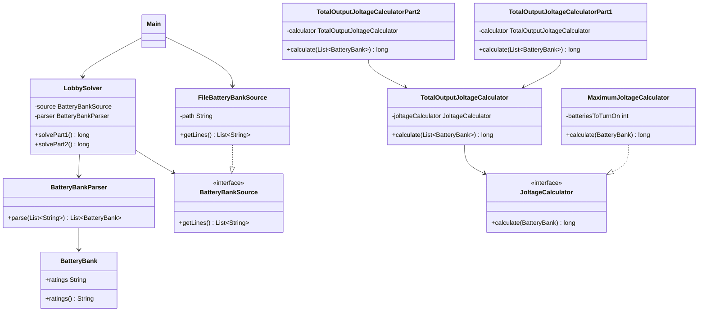

# Día 3

## Problema

El problema ocurre en el lobby, donde el escalator necesita alimentación de
emergencia. La entrada contiene una línea por cada banco de baterías. Cada carácter
de la línea representa el joltage de una batería, siempre con un valor entre `1` y
`9`.

Dentro de cada banco hay que encender un número concreto de baterías. El joltage
generado por el banco es el número formado por esas baterías en el mismo orden en el
que aparecen. No se pueden reordenar baterías.

Por ejemplo, en el banco `12345`, si se encienden las baterías `2` y `4`, el banco
produce `24` jolts.

La entrada está en:

```text
src/main/resources/input.txt
```

## Parte 1

En la primera parte hay que encender exactamente dos baterías por banco. El objetivo
es encontrar el mayor joltage que puede producir cada banco y sumar esos máximos.

Con el ejemplo oficial:

```text
987654321111111
811111111111119
234234234234278
818181911112111
```

Los mayores joltages son:

- `98`, a partir de `987654321111111`.
- `89`, a partir de `811111111111119`.
- `78`, a partir de `234234234234278`.
- `92`, a partir de `818181911112111`.

La suma total del ejemplo es:

```text
357
```

Con el input del proyecto, la respuesta de la parte 1 es:

```text
17034
```

## Parte 2

En la segunda parte hay que encender exactamente doce baterías por banco. El joltage
producido por cada banco pasa a ser un número de 12 dígitos, por lo que la suma ya no
cabe de forma segura en un `int` y se calcula con `long`.

Con el mismo ejemplo oficial, los mayores joltages son:

- `987654321111`, a partir de `987654321111111`.
- `811111111119`, a partir de `811111111111119`.
- `434234234278`, a partir de `234234234234278`.
- `888911112111`, a partir de `818181911112111`.

La suma total del ejemplo es:

```text
3121910778619
```

Con el input del proyecto, la respuesta de la parte 2 es:

```text
168798209663590
```

## Enfoque de la solución

La parte 1 podría resolverse probando todos los pares posibles de baterías, pero la
parte 2 generaliza el problema: ahora hay que escoger una subsecuencia de 12 dígitos
que forme el mayor número posible.

Por eso `MaximumJoltageCalculator` recibe cuántas baterías debe encender:

```java
new MaximumJoltageCalculator(2)
new MaximumJoltageCalculator(12)
```

El algoritmo elige los dígitos de izquierda a derecha. Para cada posición del
resultado, busca el mayor dígito posible dentro del tramo que todavía deja suficientes
baterías a la derecha para completar el número:

```java
int searchEnd = ratings.length() - (batteriesToTurnOn - selected);
int bestIndex = searchStart;

for (int currentIndex = searchStart; currentIndex <= searchEnd; currentIndex++) {
    if (ratings.charAt(currentIndex) > ratings.charAt(bestIndex)) {
        bestIndex = currentIndex;
    }
}
```

Después añade ese dígito al resultado y continúa buscando a partir de la posición
siguiente. Así se respeta el orden original de las baterías.

`TotalOutputJoltageCalculator` suma el resultado de aplicar un `JoltageCalculator` a
cada banco:

```java
return banks.stream()
        .mapToLong(joltageCalculator::calculate)
        .sum();
```

## Resolución detallada

### Parte 1

Cada línea representa un banco de baterías como una cadena de dígitos. La parte 1
necesita formar el mayor número posible encendiendo dos baterías y respetando el
orden original. La solución usa un algoritmo voraz: para cada posición del resultado
elige el mayor dígito posible dejando suficientes dígitos a la derecha para completar
el número.

La clase común `MaximumJoltageCalculator` recibe cuántas baterías hay que encender.
Para la parte 1 se instancia con `2`:

```java
public TotalOutputJoltageCalculatorPart1() {
    this(new MaximumJoltageCalculator(2));
}
```

La selección voraz mantiene `searchStart`, que impide volver atrás en la cadena:

```java
for (int selected = 0; selected < batteriesToTurnOn; selected++) {
    int searchEnd = ratings.length() - (batteriesToTurnOn - selected);
    int bestIndex = searchStart;

    for (int currentIndex = searchStart; currentIndex <= searchEnd; currentIndex++) {
        if (ratings.charAt(currentIndex) > ratings.charAt(bestIndex)) {
            bestIndex = currentIndex;
        }
    }

    maximumJoltage.append(ratings.charAt(bestIndex));
    searchStart = bestIndex + 1;
}
```

El resultado de cada banco se suma con `TotalOutputJoltageCalculator`:

```java
return banks.stream()
        .mapToLong(joltageCalculator::calculate)
        .sum();
```

### Parte 2

La segunda parte conserva exactamente el mismo problema algorítmico, pero cambia el
número de baterías que hay que seleccionar. En lugar de duplicar la lógica, se
reutiliza el mismo calculador voraz parametrizado con `12`:

```java
public TotalOutputJoltageCalculatorPart2() {
    this(new MaximumJoltageCalculator(12));
}
```

Esto funciona porque el algoritmo no depende de que se seleccionen dos dígitos:
solo necesita saber cuántas posiciones tendrá el número final. La regla de
optimización sigue siendo la misma: elegir el mayor dígito posible en cada paso sin
impedir completar las posiciones restantes.

```java
public long calculate(BatteryBank bank) {
    String ratings = bank.ratings();
    StringBuilder maximumJoltage = new StringBuilder();
    int searchStart = 0;

    for (int selected = 0; selected < batteriesToTurnOn; selected++) {
        int searchEnd = ratings.length() - (batteriesToTurnOn - selected);
        int bestIndex = searchStart;

        for (int currentIndex = searchStart; currentIndex <= searchEnd; currentIndex++) {
            if (ratings.charAt(currentIndex) > ratings.charAt(bestIndex)) {
                bestIndex = currentIndex;
            }
        }

        maximumJoltage.append(ratings.charAt(bestIndex));
        searchStart = bestIndex + 1;
    }

    return Long.parseLong(maximumJoltage.toString());
}
```

La diferencia entre partes queda aislada en la configuración del servicio, no en la
duplicación del algoritmo.

## Uso de Streams

En este día el stream principal está en `TotalOutputJoltageCalculator`. Su trabajo
es aplicar el calculador de joltage a cada banco y sumar los resultados.

```java
return banks.stream()
        .mapToLong(joltageCalculator::calculate)
        .sum();
```

El stream parte de `List<BatteryBank>`. `mapToLong(joltageCalculator::calculate)`
transforma cada banco en el valor numérico que produce la regla configurada. En la
parte 1 esa regla selecciona 2 baterías; en la parte 2 selecciona 12. Finalmente,
`sum()` acumula todos los joltages en un único total.

Este stream es importante para el diseño porque permite que la suma sea común a las
dos partes. El totalizador no sabe qué regla concreta se está usando; solo aplica el
contrato `JoltageCalculator` a cada elemento.

## Diseño de clases

La solución está dividida en tres paquetes principales:

```text
application/
domain/
  common/
  part1/
  part2/
infrastructure/
```

### `domain/common`

Contiene conceptos y servicios compartidos por ambas partes.

- `BatteryBank`: representa un banco de baterías y valida sus invariantes.
- `JoltageCalculator`: contrato para calcular el joltage de un banco.
- `MaximumJoltageCalculator`: calcula el mayor joltage posible escogiendo un número configurable de baterías.
- `TotalOutputJoltageCalculator`: suma los joltages de todos los bancos.

### `domain/part1`

Contiene la regla específica de la primera parte.

- `TotalOutputJoltageCalculatorPart1`: configura el cálculo para encender 2 baterías.

### `domain/part2`

Contiene la regla específica de la segunda parte.

- `TotalOutputJoltageCalculatorPart2`: configura el cálculo para encender 12 baterías.

### `application`

Coordina el caso de uso.

- `BatteryBankParser`: transforma las líneas del fichero en objetos `BatteryBank`.
- `LobbySolver`: lee la entrada, la parsea y delega el cálculo de cada parte.

### `infrastructure`

Contiene los detalles externos al dominio.

- `BatteryBankSource`: interfaz para obtener las líneas de entrada.
- `FileBatteryBankSource`: implementación que lee los bancos desde un fichero.

## Diagrama de clases



## Fundamentos de diseño aplicados

### Alta Cohesión

`MaximumJoltageCalculator` se centra en elegir los mejores dígitos de un banco,
`TotalOutputJoltageCalculator` solo suma resultados y las clases de parte 1 y parte
2 solo configuran cuántas baterías se encienden. Cada clase tiene una tarea
relacionada con su nombre.

### Bajo Acoplamiento

El totalizador depende de `JoltageCalculator`, no de una implementación concreta.
`LobbySolver` depende de `BatteryBankSource`, por lo que no queda acoplado a
`FileBatteryBankSource`.

### Modularidad

La regla común de cálculo está en `domain/common`, mientras que cada parte queda en
su paquete específico. La aplicación y la infraestructura quedan fuera del dominio.

### Código Expresivo

`BatteryBank`, `MaximumJoltageCalculator` y `TotalOutputJoltageCalculator` describen
la intención del código. El método `calculate` se usa de forma consistente para los
servicios de dominio.

### Abstracción

`JoltageCalculator` abstrae la forma concreta de calcular el joltage de un banco.
Gracias a eso, el totalizador puede sumar resultados sin saber si se seleccionan 2,
12 u otra cantidad de baterías.

## Principios aplicados

### Principio de Responsabilidad Única (SRP)

Cada clase tiene una única razón principal para cambiar:

- `BatteryBankParser` parsea líneas.
- `BatteryBank` representa un banco de baterías.
- `MaximumJoltageCalculator` calcula el mayor joltage para un banco.
- `TotalOutputJoltageCalculator` suma resultados de varios bancos.
- `TotalOutputJoltageCalculatorPart1` configura la parte 1.
- `TotalOutputJoltageCalculatorPart2` configura la parte 2.
- `LobbySolver` coordina el caso de uso.

### Principio Abierto/Cerrado (OCP)

La parte 2 no modifica el totalizador común: crea otra configuración con `MaximumJoltageCalculator(12)`. Si aparece otra regla, puede añadirse otra implementación de `JoltageCalculator` o una nueva configuración sin tocar `TotalOutputJoltageCalculator`.

### Principio de Sustitución de Liskov (LSP)

`TotalOutputJoltageCalculator` trabaja con el contrato `JoltageCalculator`. Cualquier implementación que calcule un `long` a partir de un `BatteryBank` puede sustituir a `MaximumJoltageCalculator` sin romper la suma.

### Principio de Segregación de la Interfaz (ISP)

`JoltageCalculator` solo exige `calculate(BatteryBank bank)` y `BatteryBankSource` solo exige leer líneas. Las clases cliente no dependen de métodos que no utilizan.

### Principio de Inversión de Dependencias (DIP)

El totalizador depende de `JoltageCalculator`, no de una implementación concreta:

```java
public TotalOutputJoltageCalculator(JoltageCalculator joltageCalculator) {
    this.joltageCalculator = Objects.requireNonNull(joltageCalculator);
}
```

`LobbySolver` también depende de `BatteryBankSource`, no de `FileBatteryBankSource`.

### Principio de Composición sobre Herencia (COI)

La variación se resuelve componiendo `TotalOutputJoltageCalculator` con un `JoltageCalculator`. No hace falta heredar de una clase base para cambiar de 2 a 12 baterías.

### Principio DRY

La suma de los resultados de todos los bancos está en `TotalOutputJoltageCalculator`. Las partes 1 y 2 reutilizan ese recorrido y solo cambian la configuración del cálculo.

### Convención sobre Configuración (CoC)

Se mantiene la convención Maven de fuentes, recursos y tests. El módulo no necesita configuración especial para integrarse en el reactor del proyecto.

### Principio YAGNI

No se añade un framework de estrategias más complejo. La interfaz `JoltageCalculator` basta para expresar la variación real del problema.

## Patrones de diseño aplicados

### Creacionales

No se aplica ningún patrón creacional de forma explícita. No hace falta `Singleton`
porque no existe ningún recurso global que deba tener una única instancia, y tampoco
se usa `Factory Method` porque la creación de objetos es simple y directa.

### Estructurales

Se refleja `Adapter` en `FileBatteryBankSource`. La aplicación trabaja con
`BatteryBankSource`, mientras que `FileBatteryBankSource` adapta `Files.readAllLines`
a esa interfaz propia del proyecto.

No se aplica `Decorator`, porque no se añaden responsabilidades dinámicamente a un
objeto envolviéndolo con otros objetos.

### De comportamiento

Se refleja `Iterator` mediante el uso de colecciones y bucles `for-each`, por ejemplo
al recorrer las líneas de entrada y los bancos de baterías. En Java este recorrido se
apoya en `Iterable`/`Iterator`, aunque el código no cree el iterador manualmente.

No se aplica `Command`, porque no hay objetos que encapsulen acciones ejecutables.
Tampoco se aplica `Observer`, porque no hay suscripciones ni notificación de cambios.

## Tests

Los tests están en:

```text
src/test/java/
```

Cubren:

- el parseo de un banco por línea;
- el rechazo de ratings fuera del rango `1` a `9`;
- el ejemplo oficial de la parte 1, cuyo resultado esperado es `357`;
- el ejemplo oficial de la parte 2, cuyo resultado esperado es `3121910778619`;
- el respeto del orden original de las baterías;
- el rechazo de bancos con menos baterías de las que exige la regla configurada;
- el uso de cualquier implementación que cumpla el contrato `JoltageCalculator`.
