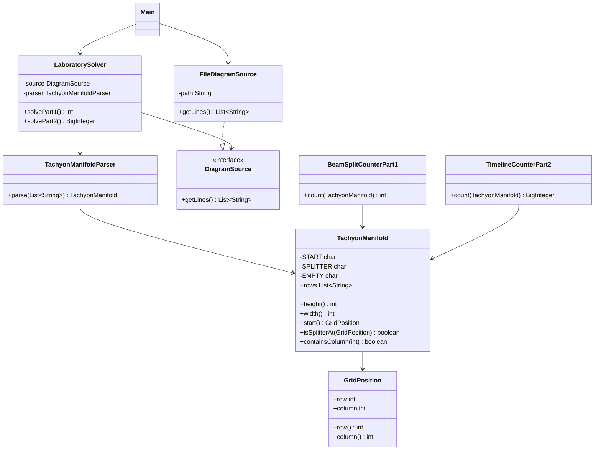

# Día 7

## Problema

El problema ocurre en un laboratorio de teleportacion. La entrada representa un
diagrama de un colector de taquiones:

- `S` indica por donde entra el haz inicial.
- `.` indica espacio vacío.
- `^` indica un divisor.

Los haces siempre avanzan hacia abajo. Si un haz llega a un divisor, ese haz se
detiene y se emiten dos haces nuevos desde las columnas inmediatamente izquierda y
derecha del divisor. Si varios haces llegan a la misma posición, se comportan como un
único haz a partir de ahí.

En la segunda parte el colector se interpreta como un colector cuántico: no se
fusionan haces clásicos, sino líneas temporales. Dos caminos distintos que llegan a
la misma posición siguen representando dos líneas temporales distintas.

La entrada está en:

```text
src/main/resources/input.txt
```

## Parte 1

El objetivo es contar cuántas veces se divide un haz.

Con el ejemplo oficial:

```text
.......S.......
...............
.......^.......
...............
......^.^......
...............
.....^.^.^.....
...............
....^.^...^....
...............
...^.^...^.^...
...............
..^...^.....^..
...............
.^.^.^.^.^...^.
...............
```

El resultado del ejemplo es:

```text
21
```

Con el input del proyecto, la respuesta de la parte 1 es:

```text
1541
```

## Parte 2

El objetivo es contar cuántas líneas temporales quedan activas después de que una
partícula complete todos sus recorridos posibles por el colector.

Con el mismo ejemplo oficial, el resultado es:

```text
40
```

Con el input del proyecto, la respuesta de la parte 2 es:

```text
80158285728929
```

## Enfoque de la solución

### Parte 1

`BeamSplitCounterPart1` simula el avance del haz fila a fila. En cada fila mantiene
un conjunto de columnas activas:

```java
Set<Integer> activeColumns = Set.of(start.column());
```

Para cada columna activa:

- si la celda contiene `^`, se suma una división y se activan las columnas izquierda
  y derecha para la siguiente fila;
- si la celda contiene `.`, la misma columna sigue activa en la siguiente fila.

Se usa un `Set` porque dos divisores pueden emitir haces hacia la misma columna. En
ese caso, los haces se fusionan y solo hace falta procesar esa columna una vez en la
siguiente fila.

### Parte 2

`TimelineCounterPart2` usa la misma idea de recorrer el colector fila a fila, pero
mantiene multiplicidad de líneas temporales con un mapa:

```java
Map<Integer, BigInteger> activeTimelines = Map.of(start.column(), BigInteger.ONE);
```

La clave es la columna activa y el valor es cuántas líneas temporales llegan a esa
columna. Para cada entrada del mapa:

- si la celda contiene `^`, cada línea temporal se divide en dos y se acumula en las
  columnas izquierda y derecha;
- si la celda contiene `.`, las mismas líneas temporales siguen en la misma columna;
- si una rama sale lateralmente del diagrama, esa línea temporal se considera
  completada.

Se usa `BigInteger` porque el número de líneas temporales crece de forma
exponencial con los divisores alcanzados y puede superar el rango de tipos enteros
pequeños.

## Resolución detallada

### Parte 1

La entrada se modela como una cuadrícula con un único punto de inicio `S` y
divisores `^`. La parte 1 simula qué columnas tienen un haz activo en cada fila.
Cuando un haz encuentra un divisor, deja de avanzar recto y se divide en dos haces:
uno a la columna izquierda y otro a la derecha.

La simulación guarda solo columnas activas, no objetos de haz completos. Esto basta
porque todos los haces avanzan una fila por iteración:

```java
GridPosition start = manifold.start();
Set<Integer> activeColumns = Set.of(start.column());

for (int row = start.row() + 1; row < manifold.height() && !activeColumns.isEmpty(); row++) {
    Set<Integer> nextActiveColumns = new HashSet<>();

    for (int column : activeColumns) {
        GridPosition position = new GridPosition(row, column);
        if (manifold.isSplitterAt(position)) {
            splits++;
            addIfInside(manifold, nextActiveColumns, column - 1);
            addIfInside(manifold, nextActiveColumns, column + 1);
        } else {
            nextActiveColumns.add(column);
        }
    }

    activeColumns = nextActiveColumns;
}
```

`Set<Integer>` evita duplicar trabajo si dos haces llegan a la misma columna en la
misma fila. Para la parte 1 solo importa contar divisiones, no cuántas líneas
temporales llegan por cada columna.

### Parte 2

La segunda parte sí necesita contar cuántas líneas temporales distintas existen. Por
eso se reemplaza el conjunto de columnas por un mapa `columna -> número de líneas`.
Cuando varias líneas llegan a la misma columna, sus cantidades se suman.

```java
Map<Integer, BigInteger> activeTimelines = Map.of(start.column(), BigInteger.ONE);
BigInteger completedTimelines = BigInteger.ZERO;
```

Al encontrar un divisor, cada línea temporal se propaga hacia izquierda y derecha.
Si una rama sale del mapa, esa línea se considera completada:

```java
private BigInteger split(TachyonManifold manifold,
                         Map<Integer, BigInteger> activeTimelines,
                         BigInteger completedTimelines,
                         int column,
                         BigInteger timelines) {
    if (manifold.containsColumn(column)) {
        addTimelines(activeTimelines, column, timelines);
        return completedTimelines;
    }
    return completedTimelines.add(timelines);
}
```

El uso de `BigInteger` evita desbordamientos cuando las divisiones multiplican el
número de líneas temporales:

```java
private void addTimelines(Map<Integer, BigInteger> activeTimelines,
                          int column,
                          BigInteger timelines) {
    activeTimelines.merge(column, timelines, BigInteger::add);
}
```

Al terminar, se suman las líneas que ya salieron del mapa y las que siguen activas
al alcanzar la última fila.

## Uso de Streams

En este día solo hay un stream, al final de la parte 2. Durante la simulación se
mantienen dos grupos de líneas temporales: las que ya han salido del mapa
(`completedTimelines`) y las que siguen activas en la última fila.

```java
return completedTimelines.add(activeTimelines.values().stream()
        .reduce(BigInteger.ZERO, BigInteger::add));
```

`activeTimelines.values()` contiene las cantidades de líneas temporales activas por
columna. El stream recorre esos valores y `reduce(BigInteger.ZERO, BigInteger::add)`
los suma. Después se añade esa suma a `completedTimelines`.

Se usa `BigInteger` porque el número de líneas puede crecer mucho al dividirse en
cada splitter.

## Diseño de clases

La solución está dividida en tres paquetes principales:

```text
application/
domain/
  common/
  part1/
  part2/
infrastructure/
```

### `domain/common`

Contiene conceptos compartidos del problema.

- `TachyonManifold`: representa el diagrama, valida sus invariantes y permite
  consultar el inicio y los divisores.
- `GridPosition`: representa una posición del diagrama mediante fila y columna.

### `domain/part1`

Contiene la regla específica de la primera parte.

- `BeamSplitCounterPart1`: cuenta las divisiones del haz.

### `domain/part2`

Contiene la regla específica de la segunda parte.

- `TimelineCounterPart2`: cuenta las líneas temporales finales conservando la
  multiplicidad de caminos.

### `application`

Coordina el caso de uso.

- `TachyonManifoldParser`: transforma las líneas del fichero en un `TachyonManifold`.
- `LaboratorySolver`: lee la entrada, la parsea y delega el cálculo.

### `infrastructure`

Contiene los detalles externos al dominio.

- `DiagramSource`: interfaz para obtener las líneas de entrada.
- `FileDiagramSource`: implementación que lee el diagrama desde un fichero.

## Diagrama de clases



## Principios aplicados

### Principio de Responsabilidad Única (SRP)

`TachyonManifoldParser` parsea, `TachyonManifold` representa y valida el diagrama, `GridPosition` modela coordenadas, `BeamSplitCounterPart1` cuenta divisiones, `TimelineCounterPart2` cuenta líneas temporales y `LaboratorySolver` coordina.

### Principio Abierto/Cerrado (OCP)

La parte 2 se añadió con `TimelineCounterPart2` sin modificar `BeamSplitCounterPart1` ni `TachyonManifold`. La cuadrícula común queda disponible para nuevas reglas de simulación.

### Principio de Sustitución de Liskov (LSP)

`LaboratorySolver` usa `DiagramSource`; cualquier fuente compatible puede sustituir a `FileDiagramSource` sin cambiar la lógica.

### Principio de Segregación de la Interfaz (ISP)

`DiagramSource` solo define la lectura de líneas. La fuente no está obligada a saber validar ni simular el colector.

### Principio de Inversión de Dependencias (DIP)

La lógica de alto nivel depende de `DiagramSource`:

```java
public LaboratorySolver(DiagramSource source) {
    this.source = source;
}
```

### Principio de Composición sobre Herencia (COI)

No hay una clase base para simuladores de haces. El solver compone el manifold y el contador concreto de cada parte.

### Principio DRY

`TachyonManifold` concentra las consultas compartidas: inicio, límites y divisores. Las dos partes no repiten la validación ni el acceso a la cuadrícula.

### Convención sobre Configuración (CoC)

El día sigue el layout Maven común del repositorio, por lo que se integra en el build sin configuración específica.

### Principio YAGNI

No se crea un motor físico ni una abstracción general de rayos. Se implementan solo las reglas de desplazamiento que aparecen en el enunciado.

## Patrones de diseño aplicados

### Creacionales

No se aplica ningún patrón creacional de forma explícita. No hace falta `Singleton`
porque no existe ningún recurso global que deba tener una única instancia, y tampoco
se usa `Factory Method` porque la creación de objetos es simple y directa.

### Estructurales

Se refleja `Adapter` en `FileDiagramSource`. La aplicación trabaja con
`DiagramSource`, mientras que `FileDiagramSource` adapta `Files.readAllLines` a esa
interfaz propia del proyecto.

No se aplica `Decorator`, porque no se añaden responsabilidades dinámicamente a un
objeto envolviéndolo con otros objetos.

### De comportamiento

Se refleja `Iterator` mediante el uso de colecciones y bucles `for-each`, por ejemplo
al recorrer columnas activas y líneas temporales. En Java este recorrido se apoya en
`Iterable`/`Iterator`, aunque el código no cree el iterador manualmente.

No se aplica `Command`, porque no hay objetos que encapsulen acciones ejecutables.
Tampoco se aplica `Observer`, porque no hay suscripciones ni notificación de cambios.

## Otras técnicas de diseño

### Abstracción del origen de datos

`DiagramSource` abstrae el origen de datos. El dominio no depende de si la entrada
viene de un fichero, de memoria o de otro sistema.

### Objeto de valor

`TachyonManifold` y `GridPosition` se modelan como `record`, por lo que representan
valores del dominio definidos por sus datos. `TachyonManifold` además valida sus
invariantes al construirse.

### Servicio de dominio

`BeamSplitCounterPart1` y `TimelineCounterPart2` actúan como servicios de dominio:
no representan entidades con identidad propia, sino operaciones que calculan los
resultados de cada parte.

### Orquestador de caso de uso

`LaboratorySolver` ofrece `solvePart1` y `solvePart2`, ocultando los pasos internos:
leer entrada, parsear el diagrama y calcular la respuesta.

## Tests

Los tests están en:

```text
src/test/java/
```

Cubren:

- el parseo de un diagrama válido;
- el rechazo de diagramas sin un único inicio;
- el ejemplo oficial de la parte 1, cuyo resultado esperado es `21`;
- la fusion de haces que llegan a la misma columna.
- el ejemplo oficial de la parte 2, cuyo resultado esperado es `40`;
- la conservación de líneas temporales distintas aunque lleguen a la misma columna;
- las líneas temporales que salen lateralmente del diagrama.

Para ejecutar los tests desde la raíz del repositorio:

```bash
mvn -pl dia7 test
```

## Ejecución

Desde la raíz del repositorio:

```bash
mvn -pl dia7 exec:java -Dexec.mainClass=Main
```

El programa imprime:

```text
Parte 1: 1541
Parte 2: 80158285728929
```
