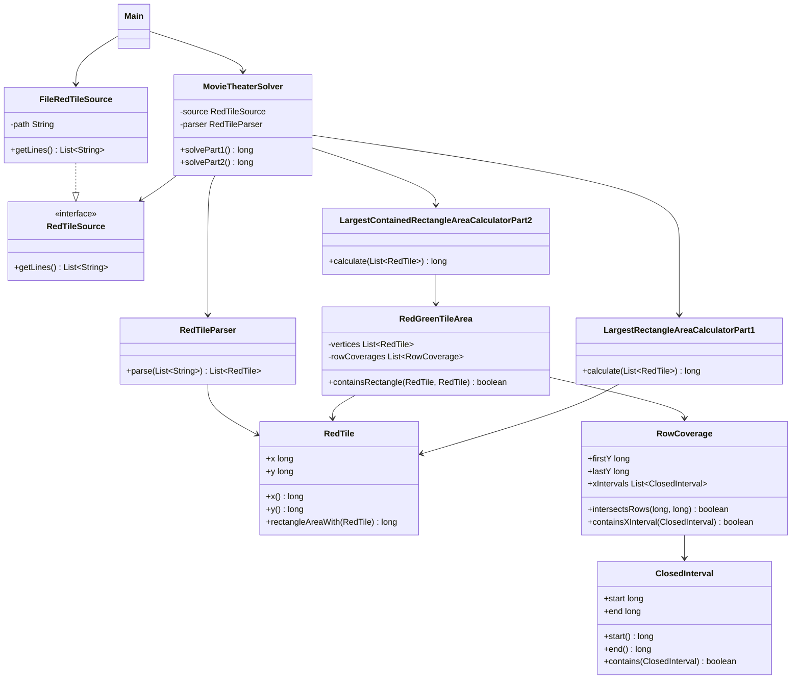

# Día 9

## Problema

El problema ocurre en un cine de la base del Polo Norte. La entrada contiene las
posiciones de baldosas rojas en una cuadrícula:

```text
7,1
11,1
```

Cada línea representa una posición `X,Y`. Se puede elegir cualquier pareja de
baldosas rojas como esquinas opuestas de un rectángulo. El objetivo es encontrar el
área máxima posible.

En la segunda parte, las baldosas rojas forman un bucle ortogonal: cada baldosa roja
está conectada con la anterior y la siguiente mediante una línea recta de baldosas
verdes. También son verdes las baldosas interiores al bucle. El rectángulo elegido
solo puede contener baldosas rojas o verdes.

La entrada está en:

```text
src/main/resources/input.txt
```

## Parte 1

El área se calcula contando baldosas, por lo que las dimensiones son inclusivas:

```text
área = (|x1 - x2| + 1) * (|y1 - y2| + 1)
```

Con el ejemplo oficial:

```text
7,1
11,1
11,7
9,7
9,5
2,5
2,3
7,3
```

El resultado es:

```text
50
```

Con el input del proyecto, la respuesta de la parte 1 es:

```text
4764078684
```

## Parte 2

El rectángulo sigue teniendo que usar dos baldosas rojas como esquinas opuestas, pero
ahora todo su contenido debe quedar dentro del área roja o verde del bucle.

Con el mismo ejemplo oficial, el resultado es:

```text
24
```

Con el input del proyecto, la respuesta de la parte 2 es:

```text
1652344888
```

## Enfoque de la solución

### Parte 1

`LargestRectangleAreaCalculatorPart1` recorre todas las parejas posibles de baldosas
rojas. Para cada pareja delega el cálculo del área en `RedTile`:

```java
long area = redTiles.get(first).rectangleAreaWith(redTiles.get(second));
```

El número de puntos del input permite una solución directa `O(n^2)`, que es simple y
exacta para esta parte.

### Parte 2

`LargestContainedRectangleAreaCalculatorPart2` también recorre parejas de baldosas
rojas, pero solo acepta un rectángulo si `RedGreenTileArea` confirma que todo el
rectángulo queda dentro del bucle.

Para evitar enumerar todas las baldosas del rectángulo, `RedGreenTileArea` comprime
el polígono por filas:

- en filas que coinciden con vértices rojos, calcula la unión de borde e interior
  adyacente;
- en tramos de filas entre dos coordenadas `Y` consecutivas, calcula una sola vez
  los intervalos de `X` que están dentro del bucle;
- un rectángulo es válido si su intervalo horizontal cabe completo en todos los
  tramos de filas que ocupa.

Esta técnica mantiene el cálculo exacto sin depender del tamaño real de las
coordenadas.

## Resolución detallada

### Parte 1

La primera parte busca el rectángulo de mayor área que puede formarse usando dos
baldosas rojas como esquinas opuestas. Como no hay restricción de contención todavía,
la solución compara todos los pares de baldosas rojas y calcula el área del
rectángulo cerrado que determinan.

El cálculo del área está en `RedTile`, porque depende únicamente de dos puntos:

```java
public long rectangleAreaWith(RedTile other) {
    long width = Math.abs(x - other.x) + 1;
    long height = Math.abs(y - other.y) + 1;
    return width * height;
}
```

La calculadora de la parte 1 recorre los pares sin repetir combinaciones:

```java
long largestArea = 0;
for (int first = 0; first < redTiles.size(); first++) {
    for (int second = first + 1; second < redTiles.size(); second++) {
        long area = redTiles.get(first).rectangleAreaWith(redTiles.get(second));
        largestArea = Math.max(largestArea, area);
    }
}

return largestArea;
```

Este planteamiento es suficiente porque cada respuesta candidata está definida por
dos vértices del conjunto de entrada.

### Parte 2

La segunda parte añade una restricción: el rectángulo elegido debe estar contenido
dentro de la zona delimitada por las baldosas rojas y verdes. La solución mantiene
la enumeración de pares, pero antes de aceptar un área comprueba si el rectángulo
queda cubierto por la figura.

Primero se construye `RedGreenTileArea`, que valida que los vértices formen un bucle
ortogonal y precalcula qué intervalos de `x` están cubiertos para grupos de filas:

```java
private List<RowCoverage> buildRowCoverages() {
    List<Long> yCoordinates = sortedYCoordinates();
    List<RowCoverage> coverages = new ArrayList<>();

    for (long y : yCoordinates) {
        coverages.add(new RowCoverage(y, y, exactRowIntervals(y)));
    }

    for (int i = 0; i < yCoordinates.size() - 1; i++) {
        long lowerY = yCoordinates.get(i);
        long upperY = yCoordinates.get(i + 1);
        long firstInteriorRow = lowerY + 1;
        long lastInteriorRow = upperY - 1;

        if (firstInteriorRow <= lastInteriorRow) {
            coverages.add(new RowCoverage(firstInteriorRow, lastInteriorRow,
                    openRowIntervals(lowerY + 0.5)));
        }
    }

    return List.copyOf(coverages);
}
```

Para comprobar un rectángulo se transforma en un intervalo horizontal y un rango de
filas. Todas las coberturas que intersectan esas filas deben contener el intervalo
completo de `x`:

```java
public boolean containsRectangle(RedTile firstCorner, RedTile secondCorner) {
    long firstX = Math.min(firstCorner.x(), secondCorner.x());
    long lastX = Math.max(firstCorner.x(), secondCorner.x());
    long firstY = Math.min(firstCorner.y(), secondCorner.y());
    long lastY = Math.max(firstCorner.y(), secondCorner.y());
    ClosedInterval xInterval = new ClosedInterval(firstX, lastX);

    return rowCoverages.stream()
            .filter(rowCoverage -> rowCoverage.intersectsRows(firstY, lastY))
            .allMatch(rowCoverage -> rowCoverage.containsXInterval(xInterval));
}
```

La parte 2 solo actualiza el máximo cuando el rectángulo es más grande que el mejor
actual y además está contenido:

```java
if (rectangleArea > largestArea
        && area.containsRectangle(firstCorner, secondCorner)) {
    largestArea = rectangleArea;
}
```

## Uso de Streams

En este día los Streams se usan para parsear, comprobar contención y ordenar o buscar
intervalos.

El parser convierte cada línea en una baldosa roja:

```java
return lines.stream()
        .map(this::parseLine)
        .toList();
```

`map(this::parseLine)` transforma texto en `RedTile`, y `toList()` devuelve la lista
de vértices que usan las dos partes.

La comprobación de si un rectángulo está dentro del área usa `filter` y `allMatch`:

```java
return rowCoverages.stream()
        .filter(rowCoverage -> rowCoverage.intersectsRows(firstY, lastY))
        .allMatch(rowCoverage -> rowCoverage.containsXInterval(xInterval));
```

El stream recorre las coberturas por filas. `filter` se queda solo con las coberturas
que afectan al rango vertical del rectángulo. `allMatch` exige que todas esas
coberturas contengan el intervalo horizontal completo; si alguna fila relevante no
lo contiene, el rectángulo no cabe.

`RowCoverage` usa `anyMatch` para comprobar si algún intervalo horizontal contiene
otro intervalo:

```java
return xIntervals.stream()
        .anyMatch(xInterval -> xInterval.contains(interval));
```

Aquí basta con encontrar un intervalo válido, por eso se usa `anyMatch`.

También ordena intervalos con un stream:

```java
List<ClosedInterval> sortedIntervals = intervals.stream()
        .sorted(Comparator.comparingLong(ClosedInterval::start))
        .toList();
```

`sorted` coloca los intervalos por su inicio. Esa lista ordenada permite validarlos y
trabajar con coberturas horizontales de forma predecible.

## Diseño de clases

La solución está dividida en tres paquetes principales:

```text
application/
domain/
  common/
  part1/
  part2/
infrastructure/
```

### `domain/common`

Contiene conceptos compartidos del problema.

- `RedTile`: representa una baldosa roja y calcula el área del rectángulo formado
  con otra baldosa.
- `ClosedInterval`: representa un intervalo cerrado de coordenadas.
- `RowCoverage`: representa los intervalos de `X` cubiertos en una o varias filas.
- `RedGreenTileArea`: representa el área roja o verde delimitada por el bucle.

### `domain/part1`

Contiene la regla específica de la primera parte.

- `LargestRectangleAreaCalculatorPart1`: busca el mayor rectángulo posible.

### `domain/part2`

Contiene la regla específica de la segunda parte.

- `LargestContainedRectangleAreaCalculatorPart2`: busca el mayor rectángulo que
  queda completamente dentro del área roja o verde.

### `application`

Coordina el caso de uso.

- `RedTileParser`: transforma las líneas del fichero en baldosas del dominio.
- `MovieTheaterSolver`: lee la entrada, la parsea y delega el cálculo.

### `infrastructure`

Contiene los detalles externos al dominio.

- `RedTileSource`: interfaz para obtener las líneas de entrada.
- `FileRedTileSource`: implementación que lee las baldosas desde un fichero.

## Diagrama de clases



## Fundamentos de diseño aplicados

### Alta Cohesión

`RedTile` representa puntos y áreas entre esquinas, `RedGreenTileArea` responde a
consultas de contención, `RowCoverage` modela cobertura horizontal y cada calculadora
resuelve una parte.

### Bajo Acoplamiento

`MovieTheaterSolver` depende de `RedTileSource`. Las calculadoras trabajan con
`RedTile` y `RedGreenTileArea`, no con el parser ni con el fichero.

### Modularidad

La geometría compartida se separa en `domain/common`. La búsqueda sin contención y la
búsqueda con contención viven en clases distintas dentro de `domain/part1` y
`domain/part2`.

### Código Expresivo

Métodos como `rectangleAreaWith`, `containsRectangle`, `intersectsRows` y
`containsXInterval` explican la intención geométrica de cada operación.

### Abstracción

`RedGreenTileArea` oculta la construcción de coberturas por filas. La calculadora de
la parte 2 solo pregunta si un rectángulo está contenido, sin conocer los detalles
del barrido geométrico.

## Principios aplicados

### Principio de Responsabilidad Única (SRP)

Cada clase tiene una responsabilidad clara:

- `RedTileParser` parsea coordenadas.
- `RedTile` representa una baldosa y calcula áreas con otra.
- `RedGreenTileArea` modela la zona contenida.
- `RowCoverage` representa cobertura horizontal por filas.
- `LargestRectangleAreaCalculatorPart1` resuelve la parte 1.
- `LargestContainedRectangleAreaCalculatorPart2` resuelve la parte 2.
- `MovieTheaterSolver` coordina el caso de uso.

### Principio Abierto/Cerrado (OCP)

La parte 2 se añade como una clase nueva que reutiliza `RedTile`, `RedGreenTileArea`, el parser y la fuente de entrada. La calculadora de la parte 1 permanece cerrada a cambios.

### Principio de Sustitución de Liskov (LSP)

`MovieTheaterSolver` depende de `RedTileSource`. Cualquier fuente que proporcione las líneas de baldosas puede sustituir a `FileRedTileSource` sin alterar el solver.

### Principio de Segregación de la Interfaz (ISP)

`RedTileSource` solo representa la capacidad de leer líneas. La interfaz no obliga a implementar parseo, validación geométrica ni escritura.

### Principio de Inversión de Dependencias (DIP)

El solver depende de la abstracción `RedTileSource`:

```java
public MovieTheaterSolver(RedTileSource source) {
    this.source = source;
}
```

La infraestructura concreta queda fuera de la lógica de aplicación.

### Principio de Composición sobre Herencia (COI)

La geometría se construye componiendo `RedTile`, `ClosedInterval`, `RowCoverage` y `RedGreenTileArea`. No se crea una jerarquía general de figuras geométricas.

### Principio DRY

`RedTile` centraliza coordenadas y cálculo de área; `RedGreenTileArea` centraliza la comprobación de contención. Las dos partes no duplican parseo ni representación de baldosas.

### Convención sobre Configuración (CoC)

El día respeta la estructura Maven común: fuentes, recursos y tests están en las rutas convencionales.

### Principio YAGNI

No se añade un motor geométrico general. Solo se implementa la geometría necesaria para rectángulos formados por baldosas del enunciado.

## Patrones de diseño aplicados

### Creacionales

No se aplica ningún patrón creacional de forma explícita. No hace falta `Singleton`
porque no existe ningún recurso global que deba tener una única instancia, y tampoco
se usa `Factory Method` porque la creación de objetos es simple y directa.

### Estructurales

Se refleja `Adapter` en `FileRedTileSource`. La aplicación trabaja con
`RedTileSource`, mientras que `FileRedTileSource` adapta `Files.readAllLines` a esa
interfaz propia del proyecto.

No se aplica `Decorator`, porque no se añaden responsabilidades dinámicamente a un
objeto envolviéndolo con otros objetos.

### De comportamiento

Se refleja `Iterator` mediante el uso de colecciones y bucles `for-each`, por ejemplo
al recorrer baldosas e intervalos. En Java este recorrido se apoya en
`Iterable`/`Iterator`, aunque el código no cree el iterador manualmente.

No se aplica `Command`, porque no hay objetos que encapsulen acciones ejecutables.
Tampoco se aplica `Observer`, porque no hay suscripciones ni notificación de cambios.

## Tests

Los tests están en:

```text
src/test/java/
```

Cubren:

- el parseo de coordenadas válidas;
- el rechazo de líneas inválidas;
- el ejemplo oficial de la parte 1, cuyo resultado esperado es `50`;
- el cálculo inclusivo de ancho y alto.
- el ejemplo oficial de la parte 2, cuyo resultado esperado es `24`;
- el rechazo de rectángulos que cruzan una concavidad del bucle.

Para ejecutar los tests desde la raíz del repositorio:

```bash
mvn -pl dia9 test
```

## Ejecución

Desde la raíz del repositorio:

```bash
mvn -pl dia9 exec:java -Dexec.mainClass=Main
```

El programa imprime:

```text
Parte 1: 4764078684
Parte 2: 1652344888
```
